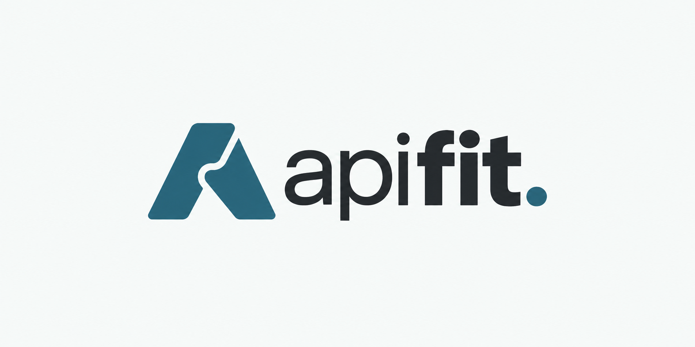

# APIFit

**Find the APIs that could help you build your idea, and understand what they can actually do.**

You have a product idea. The next step often means searching API directories,
opening unfamiliar documentation and working out which services cover which
parts of the idea. A search result alone cannot answer that last question.

I built APIFit as a tool I would use as a PM. Describe your project, explore
ranked API and MCP server listings, save a shortlist, and request an explanation
of how each integration could help. The build brief brings those choices and
their unanswered questions into one handover.



**Status:** working local application with deployment configuration prepared.
No public hosted instance is claimed. Read the [deployment guide](documentation/deployment.md)
before exposing the backend. Postman integration is outside the product scope.

## Try a concrete request

> I want to help people find specialty-coffee cafes nearby and filter them by
> bean origin and roast.

A places API might help find cafes. That does not establish that it knows
which beans a cafe serves. APIFit separates the documented capability from a
possible use in your idea, keeps the evidence available, and calls out missing
details. It does not turn a directory description into a feasibility guarantee.

## The workflow

1. **Find:** search public API and MCP directories. AI-assisted search interprets
   a plain-language request and ranks real listings; keyword search stays free.
2. **Shortlist:** save up to five integrations without an AI call.
3. **Understand:** request a short, goal-specific explanation from public
   documentation or MCP tool descriptions. Expand the source evidence if needed.
4. **Hand over:** generate a build brief with possible uses and open questions,
   then download it as Markdown. Reopening a cached explanation or downloading
   an existing brief does not make another AI request.

You can also start with **Understand an API** when you already have a public
documentation link. APIFit does not collect the recommended providers' API keys,
install MCP servers or run their tools.

## Run locally

Use a supported Node.js release, version 22 or newer. No provider key is needed
for keyword discovery or structural documentation reading.

```sh
npm ci --ignore-scripts
npm run build
npm start
```

Open **http://127.0.0.1:4173**. The default server binds to loopback only.
`npm run dev` rebuilds the frontend once and watches backend files; rebuild after
frontend edits. Optional AI setup, consent and spending rules are in
[configuration](documentation/variables.md).

```sh
npm run check        # offline tests, source checks and production build
npm run repo:check   # accidental secrets, private paths and generated artifacts
```

The default checks make no paid AI calls. Live evaluation requires a separate
opt-in and uses the existing cumulative spending ledger.

## Product decisions worth inspecting

- **Keep search central.** An earlier requirements-confirmation flow added too
  much work before users could explore. The current flow handles interpretation
  internally and makes saving a result immediate.
- **Spend on request.** Explanations and briefs run when requested. A source
  reader checks for usable capability evidence before paying for a summary.
- **Treat MCPs as integrations, not just websites.** APIFit can read public tool
  descriptions, then fall back to linked documentation. It does not mistake a
  retail homepage for proof that an integration does not exist.
- **Keep failed experiments visible.** A documentation-assisted ranking
  experiment performed worse on the evaluated corpus, so it remains disabled.

See [product scope](PRODUCT.md), the [decision log](DECISIONS.md), and the
[evaluation record](docs/search-phase-results-2026-09-16.md) for the reasoning
and measured limits.

## Evidence, not an accuracy claim

The September 16 search challenge improved reference results in the first
three positions from **17/23 to 21/23**. A separate 50-case regression found
**42/46** reference hits, with later ordering/query fixes checked separately.
These are finite benchmark results, not universal accuracy scores; the reports
retain missing-source cases and failed runs.

Known gaps include technical wording in some explanations, third-party
alternatives in own-provider searches, and missed or adjacent-purpose results.
APIFit has not measured provider uptime, account permissions or integration
behaviour. Read the [test map](documentation/tests.md) before interpreting a
green automated check as proof of recommendation quality.

## Repository map

```text
src/             React search, shortlist and explanation interface
server/          Express API, discovery, safe retrieval, parsing and bounded AI
shared/          Browser/server text and Markdown export helpers
tests/           Offline behaviour, security and regression tests
scripts/         Checks, local setup and opt-in evaluation tools
documentation/   Architecture, configuration, security and deployment guides
docs/            Dated decisions, evaluations and design evidence
PRODUCT.md       Problem, audience, scope and product boundaries
DECISIONS.md      Current decisions and links to their history
```

## Deployment and privacy

APIFit needs a Node backend; uploading `dist/` alone does not provide search or
AI. The prepared hosting path uses one process, a persistent data directory,
an exact HTTPS origin and isolated visitor sessions. Public access is supported;
a password-protected option remains available. Hosted AI stays off until an
operator configures the runtime secret and existing cost ledger. Hosting and DNS are separate
operator decisions; this repository does not provision them. Public visitors
share a finite operator-funded AI allowance; availability is not guaranteed.

Private requests and results stay in memory and expire. With AI enabled, APIFit
sends the request and selected source excerpts to Anthropic after consent;
Anthropic's retention is separate. Keep confidential text and credentials out
of inputs. See [permissions and data boundaries](documentation/permissions.md)
and [SECURITY.md](SECURITY.md).

## Licence

[MIT](LICENSE), matching Token Economist. Third-party font licensing remains
in `public/fonts/OFL-InstrumentSans.txt`.
